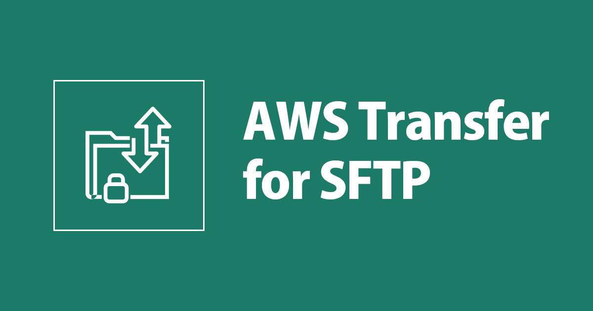
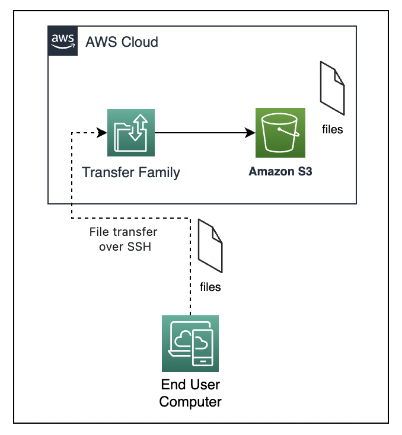
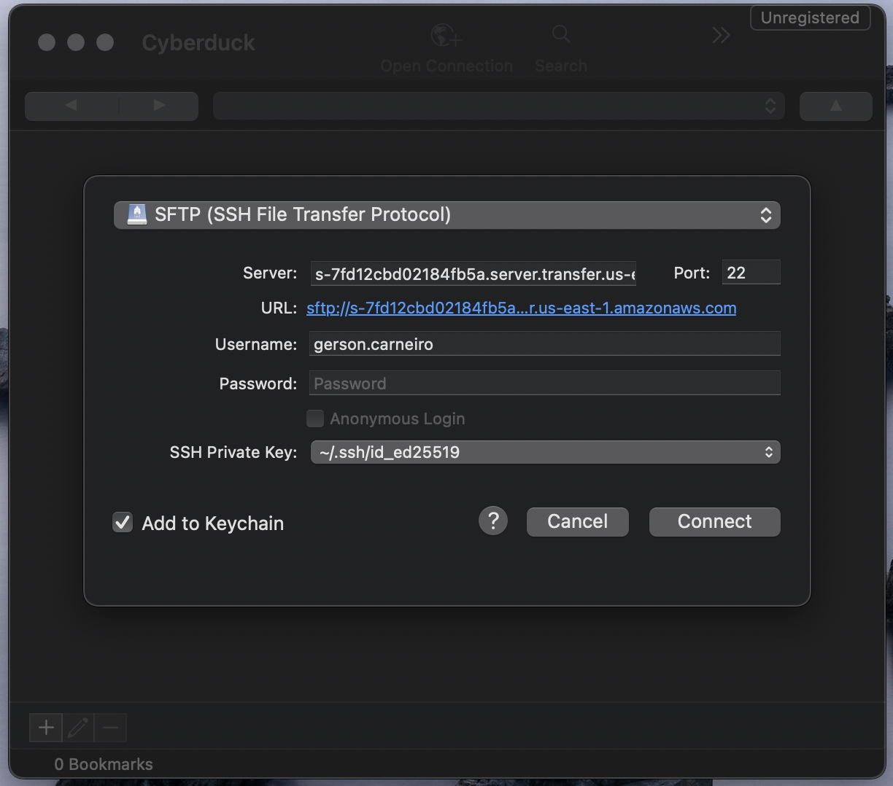
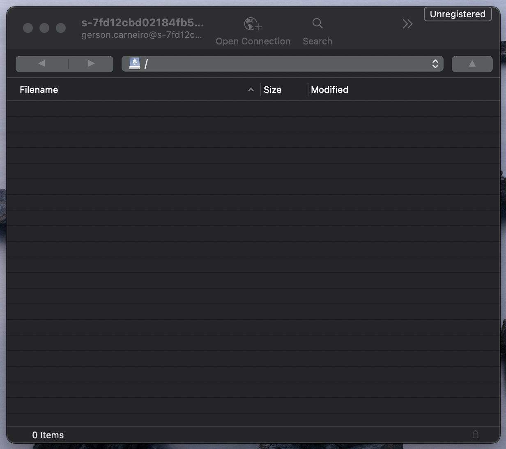
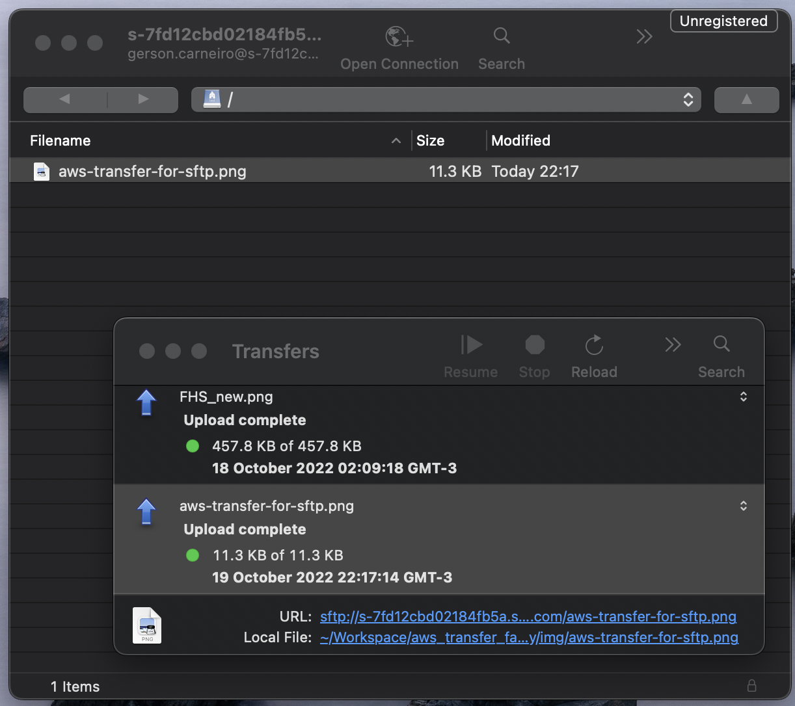
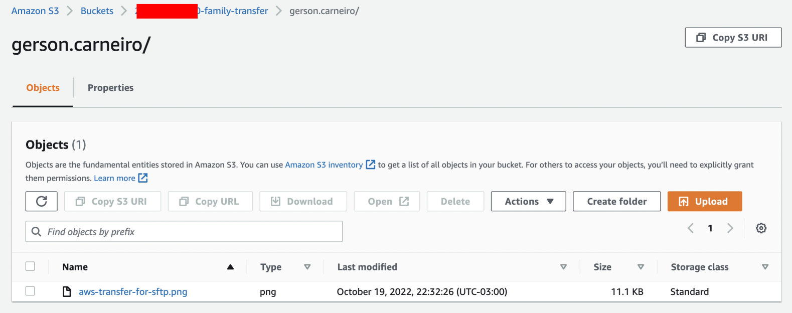
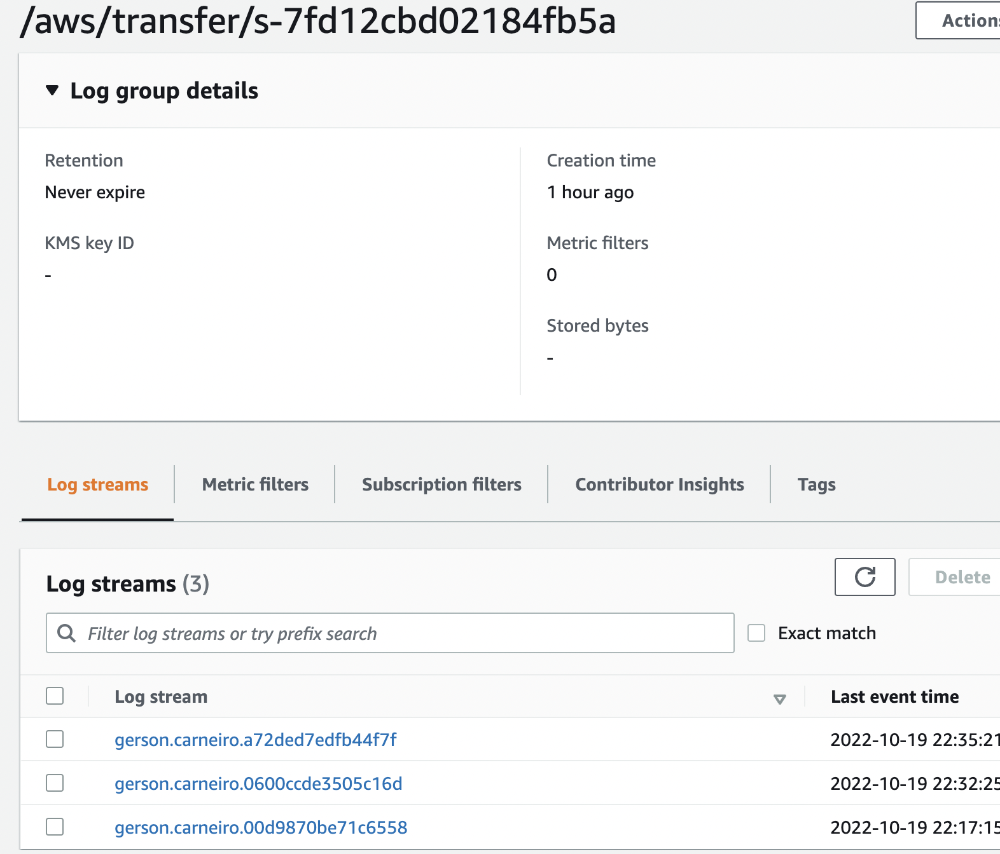

# AWS Transfer Family



IaC em Terraform para provisionar o serviço AWS Family Transfer, para envio de arquivos através de SFTP (File transfer over SSH), para um bucket S3.

POC Diagram:  


## Provisionando o ambiente

Primeiro copie o arquivo exemples/terraform.tfvars para a raiz do repositório, nos parâmetros do arquivo terraform.tfvars, preencha a variável transfer_user com as seguintes informações:

```bash
transfer_user = [
  {
    user_name = "gerson.carneiro"
    ssh_key   = "ssh-rsa AAAAB3NzaC1y....1cLc= gerson@note-mac"
  }
]
```
Caso queira incluir mais de um usuário, adicione mais um bloco no json `transfer_user`.

Ao preencher com as informações, execute seguir o fluxo do terraform.

```bash
$ terraform init (baixar os plugins do provider)
$ terraform plan (Montar o plano de execucao do que será criado no ambiente)
$ terraform apply --auto-approve
```

Após realizar o provisionamento ele irá exibir no outputs o bucket_name e transfer_server_endpoint.

```bash
Outputs:

bucket_name = "892319463762-family-transfer"
transfer_server_endpoint = "s-0e728326835446e8.server.transfer.us-east-1.amazonaws.com"
```

Eo transfer_server_endpoint será utilizado para o cliente se conectar com o Transfer Server.

Em nosso cenário, irei utilizar o cliente [Cyberduck](https://cyberduck.io/download/) porque estou utilizando MacOS, no Windows utilize o [WinSCP](https://winscp.net/eng/download.php) e no Linux [FileZilla](https://filezilla-project.org/).

No Cyberduck clique em File > Open Connection e coloque as seguintes informações conforme a imagem abaixo.

**Tipo de conexão:** SFTP (SSH File Transfer Protocol)  
**Serve:r** coloque o endpoint do transfer server: `s-0e728326835446e8.server.transfer.us-east-1.amazonaws.com`  
**SSH Private Key:** selecione a sua private key.



Pronto, o Cyberduck está conectado com o Transfer Server.



Fiz o upload de um arquivo para testarmos



Vamos acessar o Concole da AWS para conferir se o arquivo que realizei o upload está dentro do bucket.



✨ A imagem dentro do Bucket S3 =)
Repare na path que o arquivo ficou da seguinte forma, *Amazon S3/Buckets/1234567890-family-transfer/**gerson.carneiro**/aws-transfer-for-sftp.png*, no recurso `aws_transfer_user` em target adicionamos o parâmetro `$${Transfer:UserName}`, que serve para criar um diretório home para cada usuário, mantendo o bucket mais organizado e seguro.

```terraform
resource "aws_transfer_user" "this" {
...
  home_directory_type = var.home_directory_type
  home_directory_mappings {
    entry  = "/"
    target = "/${aws_s3_bucket.this.id}/$${Transfer:UserName}"
  }
...
}
```

Todos as movimentações de arquivos, gera logs que são armazenados no CloudWatch Logs.



Lembrando que além do Bucket S3 você pode utilizar o serviço AWS Amazon EFS para armazenar arquivos.

Agora vamos excluir o ambiente, execute o comando abaixo.
```bash
terraform destroy --auto-approve 
```

Documentação AWS [Transfer Family](https://aws.amazon.com/pt/aws-transfer-family/)


<!-- BEGINNING OF PRE-COMMIT-TERRAFORM DOCS HOOK -->
## Requirements

| Name | Version |
|------|---------|
| <a name="requirement_terraform"></a> [terraform](#requirement\_terraform) | >= 1.3.2 |
| <a name="requirement_aws"></a> [aws](#requirement\_aws) | ~> 4.34.0 |

## Providers

| Name | Version |
|------|---------|
| <a name="provider_aws"></a> [aws](#provider\_aws) | 4.34.0 |

## Modules

No modules.

## Resources

| Name | Type |
|------|------|
| [aws_iam_role.transfer_logs](https://registry.terraform.io/providers/hashicorp/aws/latest/docs/resources/iam_role) | resource |
| [aws_iam_role.transfer_server](https://registry.terraform.io/providers/hashicorp/aws/latest/docs/resources/iam_role) | resource |
| [aws_iam_role_policy.transfer_logs](https://registry.terraform.io/providers/hashicorp/aws/latest/docs/resources/iam_role_policy) | resource |
| [aws_iam_role_policy.transfer_server](https://registry.terraform.io/providers/hashicorp/aws/latest/docs/resources/iam_role_policy) | resource |
| [aws_s3_bucket.this](https://registry.terraform.io/providers/hashicorp/aws/latest/docs/resources/s3_bucket) | resource |
| [aws_s3_bucket_acl.this](https://registry.terraform.io/providers/hashicorp/aws/latest/docs/resources/s3_bucket_acl) | resource |
| [aws_s3_bucket_public_access_block.this](https://registry.terraform.io/providers/hashicorp/aws/latest/docs/resources/s3_bucket_public_access_block) | resource |
| [aws_transfer_server.transfer_server](https://registry.terraform.io/providers/hashicorp/aws/latest/docs/resources/transfer_server) | resource |
| [aws_transfer_ssh_key.this](https://registry.terraform.io/providers/hashicorp/aws/latest/docs/resources/transfer_ssh_key) | resource |
| [aws_transfer_user.this](https://registry.terraform.io/providers/hashicorp/aws/latest/docs/resources/transfer_user) | resource |
| [aws_caller_identity.current](https://registry.terraform.io/providers/hashicorp/aws/latest/docs/data-sources/caller_identity) | data source |
| [aws_iam_policy_document.logs](https://registry.terraform.io/providers/hashicorp/aws/latest/docs/data-sources/iam_policy_document) | data source |
| [aws_iam_policy_document.s3_permission](https://registry.terraform.io/providers/hashicorp/aws/latest/docs/data-sources/iam_policy_document) | data source |
| [aws_iam_policy_document.transfer_role](https://registry.terraform.io/providers/hashicorp/aws/latest/docs/data-sources/iam_policy_document) | data source |

## Inputs

| Name | Description | Type | Default | Required |
|------|-------------|------|---------|:--------:|
| <a name="input_force_destroy"></a> [force\_destroy](#input\_force\_destroy) | Forces the AWS Transfer Server to be destroyed | `bool` | `false` | no |
| <a name="input_home_directory_type"></a> [home\_directory\_type](#input\_home\_directory\_type) | The type of landing directory (folder) you mapped for your users' home directory. | `string` | `"LOGICAL"` | no |
| <a name="input_identity_provider_type"></a> [identity\_provider\_type](#input\_identity\_provider\_type) | The mode of authentication enabled for this service | `string` | `"SERVICE_MANAGED"` | no |
| <a name="input_protocols"></a> [protocols](#input\_protocols) | Change list acceptable protocols | `list(any)` | <pre>[<br>  "SFTP"<br>]</pre> | no |
| <a name="input_security_policy_name"></a> [security\_policy\_name](#input\_security\_policy\_name) | Specifies the name of the security policy that is attached to the server. Possible values are TransferSecurityPolicy-2018-11, TransferSecurityPolicy-2020-06, and TransferSecurityPolicy-FIPS-2020-06. Default value is: TransferSecurityPolicy-2018-11. | `string` | `"TransferSecurityPolicy-2020-06"` | no |
| <a name="input_tags"></a> [tags](#input\_tags) | A map of tags to add to all resources | `map(string)` | `{}` | no |
| <a name="input_transfer_server_name"></a> [transfer\_server\_name](#input\_transfer\_server\_name) | Set transfer family server name | `string` | `"transfer_labs"` | no |
| <a name="input_transfer_user"></a> [transfer\_user](#input\_transfer\_user) | Set list username and ssh\_key | <pre>list(object({<br>    user_name = string<br>    ssh_key   = string<br>  }))</pre> | n/a | yes |

## Outputs

| Name | Description |
|------|-------------|
| <a name="output_bucket_name"></a> [bucket\_name](#output\_bucket\_name) | n/a |
| <a name="output_transfer_server_endpoint"></a> [transfer\_server\_endpoint](#output\_transfer\_server\_endpoint) | n/a |
<!-- END OF PRE-COMMIT-TERRAFORM DOCS HOOK -->


<!-- BEGIN_TF_DOCS -->
## Requirements

| Name | Version |
|------|---------|
| <a name="requirement_terraform"></a> [terraform](#requirement\_terraform) | >= 1.3.2 |
| <a name="requirement_aws"></a> [aws](#requirement\_aws) | ~> 4.34.0 |

## Providers

| Name | Version |
|------|---------|
| <a name="provider_aws"></a> [aws](#provider\_aws) | 4.34.0 |

## Modules

No modules.

## Resources

| Name | Type |
|------|------|
| [aws_iam_role.transfer_logs](https://registry.terraform.io/providers/hashicorp/aws/latest/docs/resources/iam_role) | resource |
| [aws_iam_role.transfer_server](https://registry.terraform.io/providers/hashicorp/aws/latest/docs/resources/iam_role) | resource |
| [aws_iam_role_policy.transfer_logs](https://registry.terraform.io/providers/hashicorp/aws/latest/docs/resources/iam_role_policy) | resource |
| [aws_iam_role_policy.transfer_server](https://registry.terraform.io/providers/hashicorp/aws/latest/docs/resources/iam_role_policy) | resource |
| [aws_s3_bucket.this](https://registry.terraform.io/providers/hashicorp/aws/latest/docs/resources/s3_bucket) | resource |
| [aws_s3_bucket_acl.this](https://registry.terraform.io/providers/hashicorp/aws/latest/docs/resources/s3_bucket_acl) | resource |
| [aws_s3_bucket_public_access_block.this](https://registry.terraform.io/providers/hashicorp/aws/latest/docs/resources/s3_bucket_public_access_block) | resource |
| [aws_transfer_server.transfer_server](https://registry.terraform.io/providers/hashicorp/aws/latest/docs/resources/transfer_server) | resource |
| [aws_transfer_ssh_key.this](https://registry.terraform.io/providers/hashicorp/aws/latest/docs/resources/transfer_ssh_key) | resource |
| [aws_transfer_user.this](https://registry.terraform.io/providers/hashicorp/aws/latest/docs/resources/transfer_user) | resource |
| [aws_caller_identity.current](https://registry.terraform.io/providers/hashicorp/aws/latest/docs/data-sources/caller_identity) | data source |
| [aws_iam_policy_document.logs](https://registry.terraform.io/providers/hashicorp/aws/latest/docs/data-sources/iam_policy_document) | data source |
| [aws_iam_policy_document.s3_permission](https://registry.terraform.io/providers/hashicorp/aws/latest/docs/data-sources/iam_policy_document) | data source |
| [aws_iam_policy_document.transfer_role](https://registry.terraform.io/providers/hashicorp/aws/latest/docs/data-sources/iam_policy_document) | data source |

## Inputs

| Name | Description | Type | Default | Required |
|------|-------------|------|---------|:--------:|
| <a name="input_force_destroy"></a> [force\_destroy](#input\_force\_destroy) | Forces the AWS Transfer Server to be destroyed | `bool` | `false` | no |
| <a name="input_home_directory_type"></a> [home\_directory\_type](#input\_home\_directory\_type) | The type of landing directory (folder) you mapped for your users' home directory. | `string` | `"LOGICAL"` | no |
| <a name="input_identity_provider_type"></a> [identity\_provider\_type](#input\_identity\_provider\_type) | The mode of authentication enabled for this service | `string` | `"SERVICE_MANAGED"` | no |
| <a name="input_protocols"></a> [protocols](#input\_protocols) | Change list acceptable protocols | `list(any)` | <pre>[<br>  "SFTP"<br>]</pre> | no |
| <a name="input_security_policy_name"></a> [security\_policy\_name](#input\_security\_policy\_name) | Specifies the name of the security policy that is attached to the server. Possible values are TransferSecurityPolicy-2018-11, TransferSecurityPolicy-2020-06, and TransferSecurityPolicy-FIPS-2020-06. Default value is: TransferSecurityPolicy-2018-11. | `string` | `"TransferSecurityPolicy-2020-06"` | no |
| <a name="input_tags"></a> [tags](#input\_tags) | A map of tags to add to all resources | `map(string)` | `{}` | no |
| <a name="input_transfer_server_name"></a> [transfer\_server\_name](#input\_transfer\_server\_name) | Set transfer family server name | `string` | `"transfer_labs"` | no |
| <a name="input_transfer_user"></a> [transfer\_user](#input\_transfer\_user) | Set list username and ssh\_key | <pre>list(object({<br>    user_name = string<br>    ssh_key   = string<br>  }))</pre> | n/a | yes |

## Outputs

| Name | Description |
|------|-------------|
| <a name="output_bucket_name"></a> [bucket\_name](#output\_bucket\_name) | n/a |
| <a name="output_transfer_server_endpoint"></a> [transfer\_server\_endpoint](#output\_transfer\_server\_endpoint) | n/a |
<!-- END_TF_DOCS -->